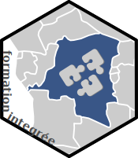

Formation Integrée 
====================================================================================================

<!-- badges: start -->

<!-- badges: end -->

## Contexte
Une collection de codes développés lors d'une formation pour la Cellule d'Analyse Intégrée à Kinshasa, RDC.

